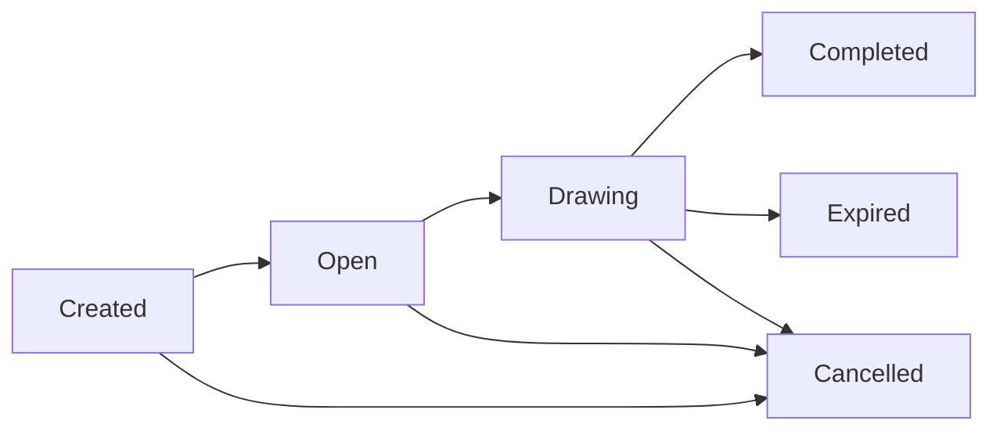

# Decentralized Lottery - Frontend Integration Guide

## Overview
This document outlines the frontend integration requirements for the Decentralized Lottery program. It provides detailed information about program states, account structures, and necessary frontend implementations for the StockAnalysisGUI project.

## Table of Contents
1. [Program States](#program-states)
2. [Account Structures](#account-structures)
3. [Frontend Features](#frontend-features)
4. [Integration Requirements](#integration-requirements)
5. [State Transitions](#state-transitions)
6. [Error Handling](#error-handling)
7. [Event Monitoring](#event-monitoring)
8. [StockAnalysisGUI Integration](#stockanalysisgui-integration)
9. [Development Workflow](#development-workflow)
10. [Configuration Management](#configuration-management)

## Program States

### Lottery States
```typescript
enum LotteryState {
    Created,    // Initial state after creation
    Open,       // Accepting ticket purchases
    Drawing,    // Winner selection in progress
    Completed,  // Winners selected
    Expired,    // No tickets sold by draw time
    Cancelled   // Lottery cancelled by admin
}
```

### State Flow


## Account Structures

### LotteryAccount
```typescript
interface LotteryAccount {
    lotteryType: LotteryType;
    ticketPrice: BN;
    drawTime: BN;
    prizePool: BN;
    totalTickets: BN;
    winningNumbers: number[] | null;
    state: LotteryState;
    createdBy: PublicKey;
    globalConfig: PublicKey;
    autoTransition: boolean;
    lastTicketId: BN;
    oraclePubkey: PublicKey | null;
    isPrizePoolLocked: boolean;
}
```

## Frontend Features

### 1. Lottery Creation
```typescript
interface CreateLotteryParams {
    lotteryType: LotteryType;
    ticketPrice: BN;
    drawTime: BN;
    prizePool: BN;
}

// Required Accounts
interface CreateLotteryAccounts {
    creator: PublicKey;
    globalConfig: PublicKey;
    tokenMint: PublicKey;
    creatorTokenAccount: PublicKey;
    lotteryTokenAccount: PublicKey;
}
```

**Implementation Requirements:**
- Admin wallet connection
- USDC token account setup
- Prize pool funding validation
- Draw time selection (future timestamp)
- Token approval for prize pool transfer

### 2. Ticket Purchase
```typescript
interface BuyTicketParams {
    numberOfTickets: BN;
    ticketNumbers: number[];
}

interface BuyTicketAccounts {
    lottery: PublicKey;
    purchaser: PublicKey;
    purchaserUsdcAta: PublicKey;
    lotteryUsdcAta: PublicKey;
}
```

**Implementation Requirements:**
- Wallet connection
- USDC balance check
- Token approval for ticket purchase
- Ticket number selection UI
- Purchase confirmation dialog

### 3. State Transitions
```typescript
interface TransitionStateParams {
    nextState: LotteryState;
}

interface TransitionStateAccounts {
    lotteryAccount: PublicKey;
    globalConfig: PublicKey;
    lotteryTokenAccount: PublicKey;
    oracleAccount?: PublicKey;
    admin: PublicKey;
}
```

**Implementation Requirements:**
- Admin authorization check
- State transition validation
- Oracle integration for Drawing state
- Event monitoring for state changes

### 4. Prize Distribution
```typescript
interface ClaimPrizeParams {
    ticketId: BN;
}

interface ClaimPrizeAccounts {
    lottery: PublicKey;
    winner: PublicKey;
    winnerTokenAccount: PublicKey;
    lotteryTokenAccount: PublicKey;
}
```

## Integration Requirements

### 1. Wallet Integration
- Phantom Wallet support
- Token account management
- Transaction signing
- Balance monitoring

### 2. Token Management
```typescript
// USDC Token Setup
const usdcMint = new PublicKey("YOUR_USDC_MINT");
const userUsdcAta = await getAssociatedTokenAddress(
    usdcMint,
    userWallet.publicKey
);
```

### 3. Account Monitoring
```typescript
// Subscribe to account changes
program.account.lotteryAccount.subscribe(lotteryPda, "confirmed");

// Monitor events
program.addEventListener("LotteryStateChanged", (event) => {
    // Handle state change
});
```

## State Transitions

### 1. Created -> Open
**Frontend Requirements:**
- Admin dashboard for state management
- Prize pool validation display
- Countdown to draw time
- Token account status monitoring

### 2. Open -> Drawing
**Frontend Requirements:**
- Ticket sales summary
- Draw time countdown
- Oracle status monitoring
- Prize pool lock status display

### 3. Drawing -> Completed/Expired
**Frontend Requirements:**
- Winner selection animation
- Winning numbers display
- Prize distribution status
- Claim button for winners

## Error Handling

### Common Errors
```typescript
enum LotteryError {
    InvalidTicketPrice = "Invalid ticket price",
    InvalidPrizePool = "Invalid prize pool",
    InvalidDrawTime = "Invalid draw time",
    UnauthorizedAccess = "Unauthorized access",
    // ... other errors
}
```

**Implementation Requirements:**
- User-friendly error messages
- Transaction failure handling
- State validation errors
- Balance insufficient warnings

## Event Monitoring

### Events to Monitor
```typescript
interface LotteryCreated {
    lotteryId: PublicKey;
    lotteryType: string;
    ticketPrice: BN;
    drawTime: BN;
    prizePool: BN;
}

interface LotteryStateChanged {
    lotteryId: PublicKey;
    previousState: LotteryState;
    newState: LotteryState;
    timestamp: BN;
    totalTicketsSold: BN;
    currentPrizePool: BN;
}

interface TicketPurchased {
    lotteryId: PublicKey;
    buyer: PublicKey;
    numberOfTickets: BN;
    totalCost: BN;
    timestamp: BN;
}
```

**Implementation Requirements:**
- Real-time event listeners
- UI updates on state changes
- Transaction confirmation displays
- Activity history tracking

## Testing Requirements

### 1. Unit Tests
- Wallet connection
- Account creation
- Token transfers
- State transitions

### 2. Integration Tests
- Complete lottery lifecycle
- Error handling
- Event processing
- Token management

### 3. UI/UX Tests
- Responsive design
- Error message display
- Loading states
- Transaction feedback

## Security Considerations

### 1. Wallet Security
- Secure key management
- Transaction signing validation
- Balance protection

### 2. Transaction Security
- Double confirmation for important actions
- Clear transaction information
- Gas fee estimation

### 3. Data Validation
- Input sanitization
- Amount validation
- State transition checks

## Performance Requirements

### 1. Loading Times
- Initial load < 3s
- Transaction confirmation < 2s
- State updates < 1s

### 2. Real-time Updates
- Account balance
- Lottery state
- Ticket sales
- Prize pool

## Documentation Requirements

### 1. API Documentation
- All function signatures
- Account structures
- Event formats
- Error codes

### 2. User Documentation
- Wallet setup guide
- Token management
- Ticket purchase flow
- Prize claim process

## StockAnalysisGUI Integration

### 1. Project Structure
The decentralized lottery is integrated into the StockAnalysisGUI project with the following structure:

```
stockanalysisgui/
├── src/
│   ├── lib/
│   │   └── solana/
│   │       ├── decentralized_lottery.json  // Program IDL
│   │       └── lottery.ts                  // Program client
│   ├── types/
│   │   └── lottery_types.ts                // TypeScript types
│   ├── components/
│   │   └── lottery/                        // Lottery UI components
│   └── pages/
│       └── lottery/                        // Lottery pages
```

### 2. IDL and Type Management
The IDL and TypeScript types are automatically synchronized with the Solana program using the build scripts:

```typescript
// Import the IDL and types in your frontend code
import { IDL } from '@/lib/solana/decentralized_lottery.json';
import { DecentralizedLottery } from '@/types/lottery_types';

// Create a program instance
const program = new Program<DecentralizedLottery>(
  IDL as DecentralizedLottery,
  programId,
  provider
);
```

### 3. USDC Mint Configuration
The USDC mint address is dynamically fetched from the on-chain global configuration:

```typescript
// Fetch the current USDC mint from global config
const fetchCurrentConfig = async () => {
  const [globalConfigPDA] = PublicKey.findProgramAddressSync(
    [Buffer.from('global_config')],
    programId
  );
  
  const configAccount = await program.account.globalConfig.fetch(globalConfigPDA);
  return configAccount.usdcMint;
};

// Use the fetched mint for token operations
const usdcMint = await fetchCurrentConfig();
const userUsdcAta = await getAssociatedTokenAddress(
  usdcMint,
  wallet.publicKey
);
```

### 4. Required Components

#### Lottery Dashboard
```tsx
// Example lottery dashboard component
const LotteryDashboard = () => {
  const [lotteries, setLotteries] = useState<LotteryAccount[]>([]);
  const { program } = useSolanaProgram();
  
  useEffect(() => {
    const fetchLotteries = async () => {
      const accounts = await program.account.lotteryAccount.all();
      setLotteries(accounts.map(a => a.account));
    };
    
    fetchLotteries();
    
    // Subscribe to new lottery events
    const listener = program.addEventListener("LotteryCreated", () => {
      fetchLotteries();
    });
    
    return () => {
      program.removeEventListener(listener);
    };
  }, [program]);
  
  return (
    <div>
      <h1>Active Lotteries</h1>
      {lotteries.map(lottery => (
        <LotteryCard key={lottery.publicKey.toString()} lottery={lottery} />
      ))}
    </div>
  );
};
```

#### Ticket Purchase Form
```tsx
// Example ticket purchase component
const TicketPurchaseForm = ({ lottery }) => {
  const [quantity, setQuantity] = useState(1);
  const { program, wallet } = useSolanaProgram();
  
  const handlePurchase = async () => {
    try {
      // Get USDC mint from global config
      const [globalConfigPDA] = PublicKey.findProgramAddressSync(
        [Buffer.from('global_config')],
        program.programId
      );
      const config = await program.account.globalConfig.fetch(globalConfigPDA);
      
      // Get user's token account
      const userUsdcAta = await getAssociatedTokenAddress(
        config.usdcMint,
        wallet.publicKey
      );
      
      // Get lottery's token account
      const [lotteryUsdcAta] = await PublicKey.findProgramAddressSync(
        [Buffer.from('lottery_token'), lottery.publicKey.toBuffer()],
        program.programId
      );
      
      // Execute transaction
      await program.methods
        .buyTicket(new BN(quantity))
        .accounts({
          lottery: lottery.publicKey,
          purchaser: wallet.publicKey,
          purchaserUsdcAta: userUsdcAta,
          lotteryUsdcAta: lotteryUsdcAta,
          tokenProgram: TOKEN_PROGRAM_ID,
        })
        .rpc();
        
      // Show success notification
    } catch (error) {
      // Handle error
      console.error('Purchase failed:', error);
    }
  };
  
  return (
    <form onSubmit={handlePurchase}>
      <input 
        type="number" 
        min="1" 
        value={quantity} 
        onChange={e => setQuantity(parseInt(e.target.value))} 
      />
      <button type="submit">Buy Tickets</button>
    </form>
  );
};
```

### 5. Admin Features
Admin features should be conditionally rendered based on the user's wallet address:

```tsx
const AdminPanel = () => {
  const { program, wallet } = useSolanaProgram();
  const [isAdmin, setIsAdmin] = useState(false);
  
  useEffect(() => {
    const checkAdminStatus = async () => {
      const [globalConfigPDA] = PublicKey.findProgramAddressSync(
        [Buffer.from('global_config')],
        program.programId
      );
      
      try {
        const config = await program.account.globalConfig.fetch(globalConfigPDA);
        setIsAdmin(config.admin.equals(wallet.publicKey));
      } catch (error) {
        console.error('Failed to check admin status:', error);
      }
    };
    
    if (wallet.connected) {
      checkAdminStatus();
    }
  }, [program, wallet]);
  
  if (!isAdmin) return null;
  
  return (
    <div>
      <h2>Admin Panel</h2>
      <CreateLotteryForm />
      <UpdateConfigForm />
      <ManageLotteriesPanel />
    </div>
  );
};
```

## Development Workflow

### 1. Synchronizing IDL and Types
The decentralized lottery program includes automated scripts to keep the frontend in sync with the Solana program:

```bash
# From the decentralized-lottery directory:

# Full build process (clean, build, update IDL)
npm run build:full

# After making program changes (build and update IDL)
npm run build

# Update IDL and types only
npm run update-idl
```

These scripts automatically:
1. Generate TypeScript types from the IDL
2. Copy the IDL to `stockanalysisgui/src/lib/solana/decentralized_lottery.json`
3. Copy and transform the types to `stockanalysisgui/src/types/lottery_types.ts`

### 2. Frontend Development Steps

1. **Initialize the Program Client**
```typescript
// src/lib/solana/lottery.ts
import { Connection, PublicKey } from '@solana/web3.js';
import { Program, AnchorProvider } from '@project-serum/anchor';
import { IDL } from './decentralized_lottery.json';
import { DecentralizedLottery } from '@/types/lottery_types';

export const PROGRAM_ID = new PublicKey('YOUR_PROGRAM_ID');

export function getLotteryProgram(provider: AnchorProvider) {
  return new Program<DecentralizedLottery>(
    IDL as DecentralizedLottery,
    PROGRAM_ID,
    provider
  );
}
```

2. **Create a Custom Hook**
```typescript
// src/hooks/useLotteryProgram.ts
import { useWallet } from '@solana/wallet-adapter-react';
import { useConnection } from '@solana/wallet-adapter-react';
import { useMemo } from 'react';
import { AnchorProvider } from '@project-serum/anchor';
import { getLotteryProgram, PROGRAM_ID } from '@/lib/solana/lottery';

export function useLotteryProgram() {
  const { connection } = useConnection();
  const wallet = useWallet();
  
  const provider = useMemo(() => {
    if (!wallet) return null;
    return new AnchorProvider(
      connection,
      wallet as any,
      { commitment: 'confirmed' }
    );
  }, [connection, wallet]);
  
  const program = useMemo(() => {
    if (!provider) return null;
    return getLotteryProgram(provider);
  }, [provider]);
  
  return { program, programId: PROGRAM_ID };
}
```

3. **Implement UI Components**
   - Create lottery list component
   - Create lottery detail component
   - Create ticket purchase form
   - Create admin panel (conditionally rendered)
   - Create winner display component

## Configuration Management

### 1. USDC Mint Address
The USDC mint address is stored in the on-chain global configuration and can be updated by the admin. Your frontend should:

1. **Fetch the current mint address on startup**
```typescript
const [usdcMint, setUsdcMint] = useState<PublicKey | null>(null);

useEffect(() => {
  const fetchConfig = async () => {
    const [globalConfigPDA] = PublicKey.findProgramAddressSync(
      [Buffer.from('global_config')],
      program.programId
    );
    
    try {
      const config = await program.account.globalConfig.fetch(globalConfigPDA);
      setUsdcMint(config.usdcMint);
    } catch (error) {
      console.error('Failed to fetch config:', error);
    }
  };
  
  if (program) {
    fetchConfig();
  }
}, [program]);
```

2. **Subscribe to configuration changes**
```typescript
useEffect(() => {
  if (!program) return;
  
  const [globalConfigPDA] = PublicKey.findProgramAddressSync(
    [Buffer.from('global_config')],
    program.programId
  );
  
  const configListener = program.account.globalConfig.subscribe(
    globalConfigPDA,
    'confirmed'
  );
  
  configListener.on('change', (account) => {
    setUsdcMint(account.usdcMint);
  });
  
  return () => {
    configListener.removeAllListeners();
    program.account.globalConfig.unsubscribe(configListener);
  };
}, [program]);
```

3. **Admin UI for updating the USDC mint**
```tsx
const UpdateUsdcMintForm = () => {
  const [newMint, setNewMint] = useState('');
  const { program, wallet } = useLotteryProgram();
  
  const handleSubmit = async (e) => {
    e.preventDefault();
    
    try {
      const mintPubkey = new PublicKey(newMint);
      const [globalConfigPDA] = PublicKey.findProgramAddressSync(
        [Buffer.from('global_config')],
        program.programId
      );
      
      await program.methods
        .updateConfig()
        .accounts({
          globalConfig: globalConfigPDA,
          admin: wallet.publicKey,
          usdcMint: mintPubkey,
        })
        .rpc();
        
      // Show success notification
    } catch (error) {
      // Handle error
      console.error('Update failed:', error);
    }
  };
  
  return (
    <form onSubmit={handleSubmit}>
      <h3>Update USDC Mint</h3>
      <input 
        type="text" 
        value={newMint} 
        onChange={e => setNewMint(e.target.value)}
        placeholder="New USDC Mint Address" 
      />
      <button type="submit">Update</button>
    </form>
  );
};
```

### 2. Environment-Specific Configuration
For different environments (development, production), use environment variables:

```typescript
// .env.local
NEXT_PUBLIC_SOLANA_NETWORK=devnet
NEXT_PUBLIC_LOTTERY_PROGRAM_ID=your_program_id

// src/config/index.ts
export const config = {
  solanaNetwork: process.env.NEXT_PUBLIC_SOLANA_NETWORK || 'devnet',
  lotteryProgramId: new PublicKey(process.env.NEXT_PUBLIC_LOTTERY_PROGRAM_ID),
  rpcEndpoint: process.env.NEXT_PUBLIC_SOLANA_NETWORK === 'mainnet-beta'
    ? 'https://api.mainnet-beta.solana.com'
    : 'https://api.devnet.solana.com',
};
```

### 3. Testing Considerations
- Create mock data for development
- Test with devnet tokens
- Implement proper error handling for network issues
- Test the full lottery lifecycle

## Implementation Checklist

- [ ] Set up Solana wallet adapter
- [ ] Implement program client and hooks
- [ ] Create lottery listing page
- [ ] Create lottery detail page
- [ ] Implement ticket purchase functionality
- [ ] Create admin panel for lottery management
- [ ] Implement configuration management
- [ ] Add real-time updates with account subscriptions
- [ ] Implement error handling and notifications
- [ ] Add loading states and optimistic UI updates
- [ ] Test with devnet tokens
- [ ] Create comprehensive documentation 