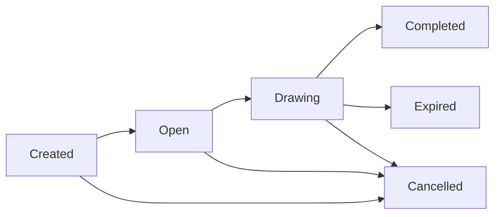

# Decentralized Lottery - Frontend Integration Guide

## Overview
This document outlines the frontend integration requirements for the Decentralized Lottery program. It provides detailed information about program states, account structures, and necessary frontend implementations.

## Table of Contents
1. [Program States](#program-states)
2. [Account Structures](#account-structures)
3. [Frontend Features](#frontend-features)
4. [Integration Requirements](#integration-requirements)
5. [State Transitions](#state-transitions)
6. [Error Handling](#error-handling)
7. [Event Monitoring](#event-monitoring)

## Program States

### Lottery States
```typescript
enum LotteryState {
    Created,    // Initial state after creation
    Open,       // Accepting ticket purchases
    Drawing,    // Winner selection in progress
    Completed,  // Winners selected
    Expired,    // No tickets sold by draw time
    Cancelled   // Lottery cancelled by admin
}
```

### State Flow


## Account Structures

### LotteryAccount
```typescript
interface LotteryAccount {
    lotteryType: LotteryType;
    ticketPrice: BN;
    drawTime: BN;
    prizePool: BN;
    totalTickets: BN;
    winningNumbers: number[] | null;
    state: LotteryState;
    createdBy: PublicKey;
    globalConfig: PublicKey;
    autoTransition: boolean;
    lastTicketId: BN;
    oraclePubkey: PublicKey | null;
    isPrizePoolLocked: boolean;
}
```

## Frontend Features

### 1. Lottery Creation
```typescript
interface CreateLotteryParams {
    lotteryType: LotteryType;
    ticketPrice: BN;
    drawTime: BN;
    prizePool: BN;
}

// Required Accounts
interface CreateLotteryAccounts {
    creator: PublicKey;
    globalConfig: PublicKey;
    tokenMint: PublicKey;
    creatorTokenAccount: PublicKey;
    lotteryTokenAccount: PublicKey;
}
```

**Implementation Requirements:**
- Admin wallet connection
- USDC token account setup
- Prize pool funding validation
- Draw time selection (future timestamp)
- Token approval for prize pool transfer

### 2. Ticket Purchase
```typescript
interface BuyTicketParams {
    numberOfTickets: BN;
    ticketNumbers: number[];
}

interface BuyTicketAccounts {
    lottery: PublicKey;
    purchaser: PublicKey;
    purchaserUsdcAta: PublicKey;
    lotteryUsdcAta: PublicKey;
}
```

**Implementation Requirements:**
- Wallet connection
- USDC balance check
- Token approval for ticket purchase
- Ticket number selection UI
- Purchase confirmation dialog

### 3. State Transitions
```typescript
interface TransitionStateParams {
    nextState: LotteryState;
}

interface TransitionStateAccounts {
    lotteryAccount: PublicKey;
    globalConfig: PublicKey;
    lotteryTokenAccount: PublicKey;
    oracleAccount?: PublicKey;
    admin: PublicKey;
}
```

**Implementation Requirements:**
- Admin authorization check
- State transition validation
- Oracle integration for Drawing state
- Event monitoring for state changes

### 4. Prize Distribution
```typescript
interface ClaimPrizeParams {
    ticketId: BN;
}

interface ClaimPrizeAccounts {
    lottery: PublicKey;
    winner: PublicKey;
    winnerTokenAccount: PublicKey;
    lotteryTokenAccount: PublicKey;
}
```

## Integration Requirements

### 1. Wallet Integration
- Phantom Wallet support
- Token account management
- Transaction signing
- Balance monitoring

### 2. Token Management
```typescript
// USDC Token Setup
const usdcMint = new PublicKey("YOUR_USDC_MINT");
const userUsdcAta = await getAssociatedTokenAddress(
    usdcMint,
    userWallet.publicKey
);
```

### 3. Account Monitoring
```typescript
// Subscribe to account changes
program.account.lotteryAccount.subscribe(lotteryPda, "confirmed");

// Monitor events
program.addEventListener("LotteryStateChanged", (event) => {
    // Handle state change
});
```

## State Transitions

### 1. Created -> Open
**Frontend Requirements:**
- Admin dashboard for state management
- Prize pool validation display
- Countdown to draw time
- Token account status monitoring

### 2. Open -> Drawing
**Frontend Requirements:**
- Ticket sales summary
- Draw time countdown
- Oracle status monitoring
- Prize pool lock status display

### 3. Drawing -> Completed/Expired
**Frontend Requirements:**
- Winner selection animation
- Winning numbers display
- Prize distribution status
- Claim button for winners

## Error Handling

### Common Errors
```typescript
enum LotteryError {
    InvalidTicketPrice = "Invalid ticket price",
    InvalidPrizePool = "Invalid prize pool",
    InvalidDrawTime = "Invalid draw time",
    UnauthorizedAccess = "Unauthorized access",
    // ... other errors
}
```

**Implementation Requirements:**
- User-friendly error messages
- Transaction failure handling
- State validation errors
- Balance insufficient warnings

## Event Monitoring

### Events to Monitor
```typescript
interface LotteryCreated {
    lotteryId: PublicKey;
    lotteryType: string;
    ticketPrice: BN;
    drawTime: BN;
    prizePool: BN;
}

interface LotteryStateChanged {
    lotteryId: PublicKey;
    previousState: LotteryState;
    newState: LotteryState;
    timestamp: BN;
    totalTicketsSold: BN;
    currentPrizePool: BN;
}

interface TicketPurchased {
    lotteryId: PublicKey;
    buyer: PublicKey;
    numberOfTickets: BN;
    totalCost: BN;
    timestamp: BN;
}
```

**Implementation Requirements:**
- Real-time event listeners
- UI updates on state changes
- Transaction confirmation displays
- Activity history tracking

## Testing Requirements

### 1. Unit Tests
- Wallet connection
- Account creation
- Token transfers
- State transitions

### 2. Integration Tests
- Complete lottery lifecycle
- Error handling
- Event processing
- Token management

### 3. UI/UX Tests
- Responsive design
- Error message display
- Loading states
- Transaction feedback

## Security Considerations

### 1. Wallet Security
- Secure key management
- Transaction signing validation
- Balance protection

### 2. Transaction Security
- Double confirmation for important actions
- Clear transaction information
- Gas fee estimation

### 3. Data Validation
- Input sanitization
- Amount validation
- State transition checks

## Performance Requirements

### 1. Loading Times
- Initial load < 3s
- Transaction confirmation < 2s
- State updates < 1s

### 2. Real-time Updates
- Account balance
- Lottery state
- Ticket sales
- Prize pool

## Documentation Requirements

### 1. API Documentation
- All function signatures
- Account structures
- Event formats
- Error codes

### 2. User Documentation
- Wallet setup guide
- Token management
- Ticket purchase flow
- Prize claim process 